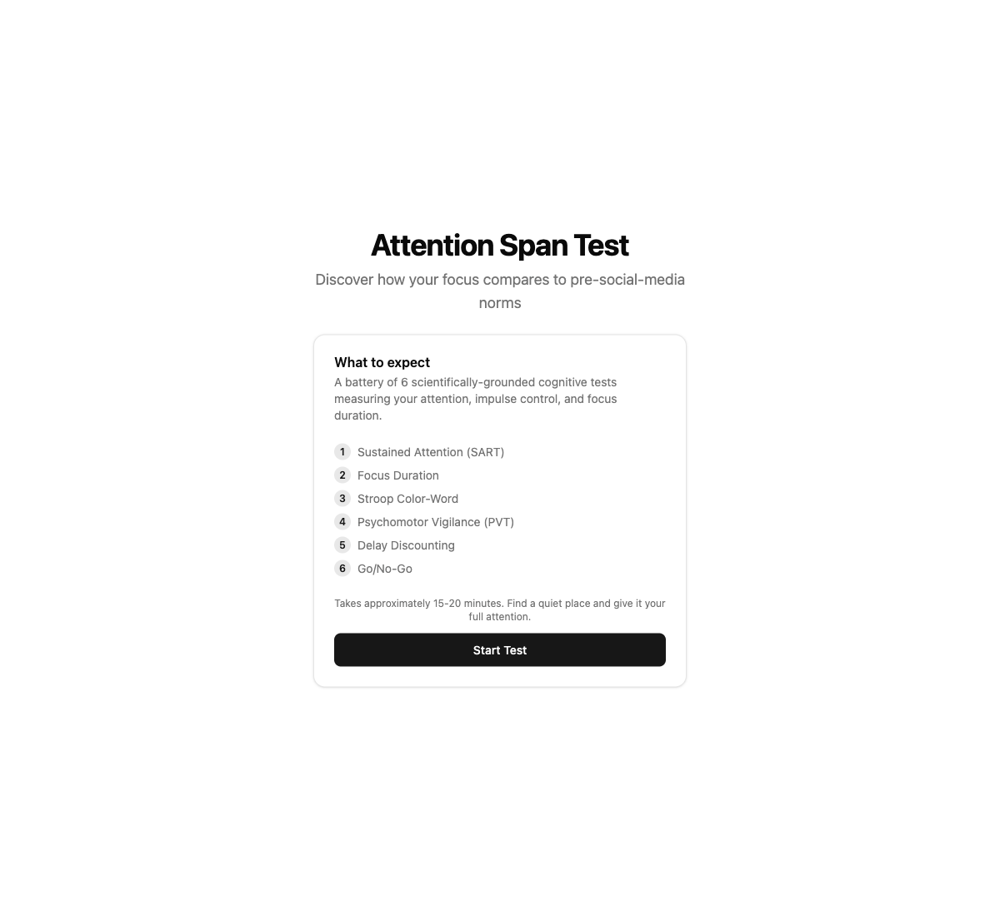
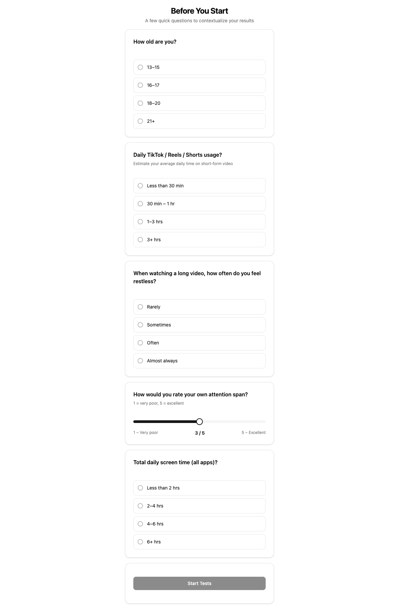
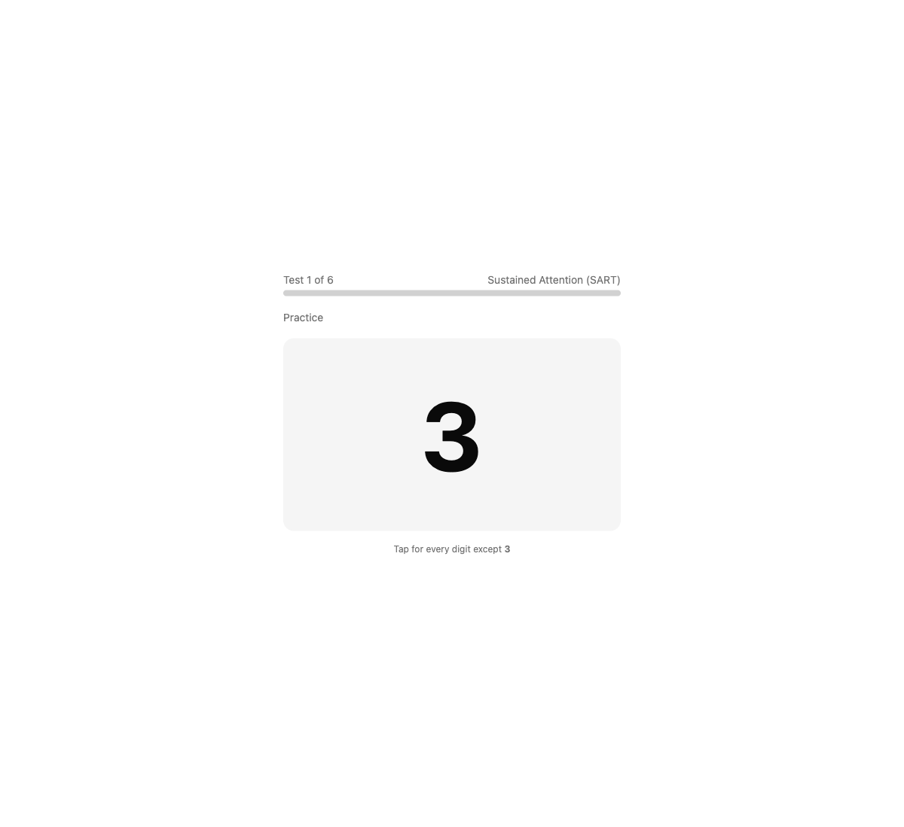
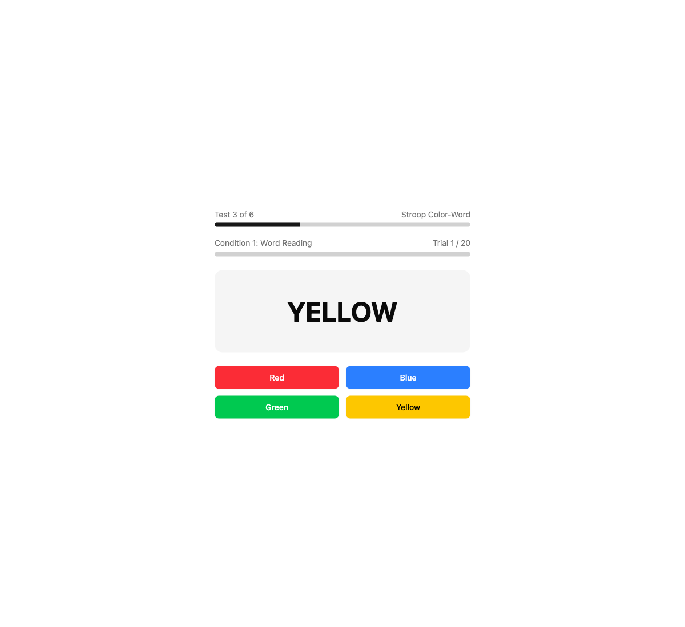
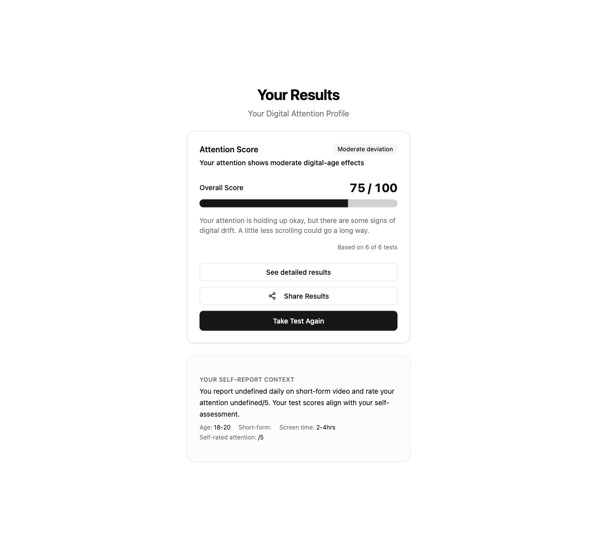
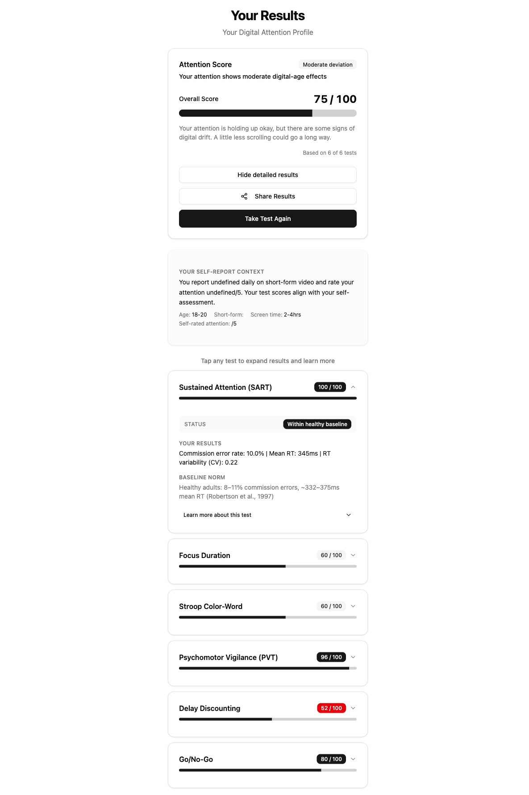

# Attention Span Test

A mobile-first web app that measures your attention, impulse control, and focus duration using a battery of scientifically-grounded cognitive tests — then compares your results against pre-social-media-era baselines from published research.

Built for teenagers (13–20) and their parents who are curious how heavy short-form video use has affected their attention.

---

## What it does

You answer a short questionnaire about your screen habits, then take 6 cognitive tests (~15–20 minutes total). At the end you get a **Digital Attention Profile** score with detailed per-test breakdowns, scientific citations, and a shareable link.

### The 6 tests

| # | Test | What it measures |
|---|------|-----------------|
| 1 | **Sustained Attention (SART)** | Ability to maintain focus and suppress impulsive taps over 225 trials |
| 2 | **Focus Duration** | How long before you feel the urge to skip a single piece of content |
| 3 | **Stroop Color-Word** | Executive control — suppressing automatic word-reading to name ink colors |
| 4 | **Psychomotor Vigilance (PVT)** | Reaction time and attention lapses over unpredictable intervals |
| 5 | **Delay Discounting** | Impulse control — preference for immediate vs. delayed rewards |
| 6 | **Go/No-Go** | Ability to withhold automatic responses to rare inhibitory signals |

---

## Screenshots

### Landing page


### Pre-test questionnaire
Captures self-reported TikTok/Reels/Shorts usage, age, and attention rating to contextualize results.



### SART — Sustained Attention Test in progress
Digits flash at 1150ms intervals. Tap for every digit except 3. Commission errors and reaction time variability are recorded.



### Stroop Color-Word Test in progress
Three conditions: word reading, color naming, then the Stroop interference condition (name the ink color, ignore what the word says).



### Results — Digital Attention Profile
Composite score out of 100 compared to pre-digital baselines, with a plain-language summary.



### Results — Per-test breakdown
Expand any test to see your score vs. the baseline norm, with scientific context and a citation link to the original paper.



---

## Features

- **Shareable link** — results are base64-encoded into the URL hash, so you can send your scores to anyone without them needing to take the test
- **Session persistence** — completed tests are saved to `sessionStorage`; refreshing won't lose your progress
- **Mobile-first** — designed for iPhone SE (375px) through iPad (1024px)
- **No backend** — fully static, all scoring happens in the browser

---

## Tech stack

- [Bun](https://bun.com) — runtime, bundler, dev server
- React + TypeScript
- Tailwind CSS + [shadcn/ui](https://ui.shadcn.com)
- Deploys to Vercel as a static site

---

## Running locally

```bash
bun install
bun dev
```

Open [http://localhost:3000](http://localhost:3000).
